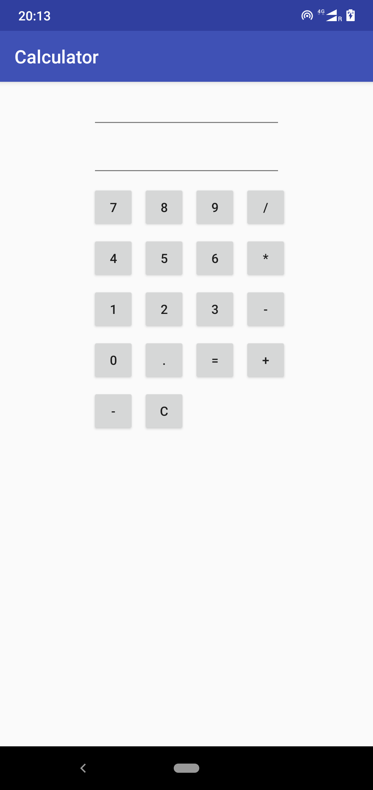
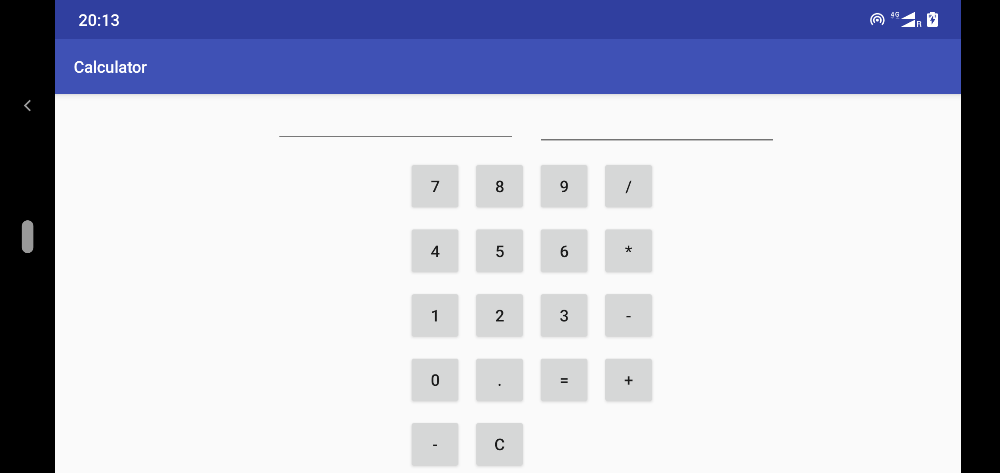

Basic Calculator App

A simple Calculator made from scratch using fundamentals of android deveopment

## Badges

Add badges from somewhere like: [shields.io](https://shields.io/)

  
## Authors

- [@daspinaki](https://github.com/daspinaki)

  

  
## Screenshots

  

  